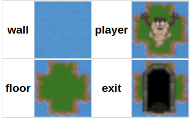
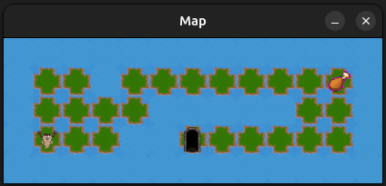
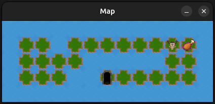
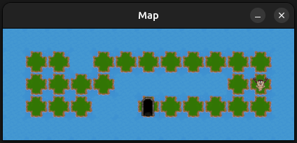

# 🎮 So_Long - A Jornada do Coletor (MiniLibX)

# Introdução

O so_long é um projeto com o intuito de criar um jogo básico 2D em que um personagem percorre um mapa em busca de coletáveis para conseguir liberar a saída e sair do jogo. 

No projeto fazemos uso da biblioteca MiniLibX uma biblioteca gráfica simples desenvolvida pela **École 42 que** permite criar janelas, desenhar imagens e capturar eventos de teclado e mouse em linguagem **C**.

# Regras

## norm

- Each function must be maximum 25 lines, not counting the function's own curly brackets.
- Each line must be at most 80 columns wide, comments included.
- A function can take 4 named parameters maximum.
- You can't declare more than 5 variables per function.
- You're not allowed to use: for, do...while, switch, case,  goto, ternary operators such as `?' and VLAs - Variable Length Arrays.

## Game

- O objetivo do jogador é coletar todos os itens coletáveis no mapa e então escapar
escolhendo a rota mais curta possível;
- As teclas W, A, S, e D devem ser usadas para mover o personagem principal;
- O jogador deve conseguir se mover nas quatro direções: cima, baixo, esquerda e direita;
- O jogador não pode ser capaz de se mover através das paredes;
- A cada movimento, o número de movimentos atual deve ser mostrado no ter-
minal shell;
- Você deve usar uma visão 2D (de cima para baixo ou de perfil);
- O jogo não precisa ser em tempo real;

## Graphic Management

- O jogo deve mostrar a imagem numa janela;
- O gerenciamento da janela deve se manter fluido (mudar para outra janela, mini-
mizar, etc.);
- Pressionar ESC deve fechar a janela e sair do programa de forma limpa;
- Clicar no X da janela deve fechar a janela e fechar o programa de forma limpa;
- O uso de images da MiniLibX é obrigatório;

## Map

- O mapa deve ser construído com 3 componentes: paredes, itens coletáveis, and
espaço livre;
- O mapa pode ser composto de somente 5 caracteres:
    - 0 para um espaço vazio,
    - 1 para uma parede,
    - C para um item coletável,
    - E para uma saída do mapa,
    - P para a posição inicial do jogador.
    

Este é um mapa válido simples:

```markdown
1111111111111
10010000000C1
1000011111001
1P0011E000001
1111111111111
```

- Para ser válido, o mapa deve conter 1 saída, 1 posição inicial e pelo menos 1
item coletável.
- Se o mapa contém caracteres duplicados (saída/início), uma mensagem
de erro deve ser exibida.
- O mapa deve ser retangular.
- O mapa deve ser fechado/cercado por paredes. Se ele não for, o programa deve
retornar um erro.
- Você deve verificar se há um caminho válido no mapa.
- Você deve ser capaz de parsear qualquer tipo de mapa, desde que ele siga as regras
acima.
- Outro exemplo de um mapa mínimo .ber:

```markdown
1111111111111111111111111111111111
1E0000000000000C00000C000000000001
1010010100100000101001000000010101
1010010010101010001001000000010101
1P0000000C00C0000000000000000000C1
1111111111111111111111111111111111
```

- Se qualquer erro de configuração for encontrado no arquivo, o programa deve sair
de forma limpa, e retornar "Error\n"seguido de uma mensagem de erro explícita da
sua escolha.

## Usando os Tiles

### Como montar o Mapa

Umas das primeira noções a aprender é o que são tiles e sprites e como são usados para montar mapas de jogos. **Tiles** são pequenas unidades gráficas (geralmente quadrada) usadas para construir o cenário de um jogo 2D. **Sprites** são imagens ou personagens móveis desenhados sobre os tiles, representando elementos como o jogador, inimigos ou objetos.

No so_long receberemos um mapa que deverá ser parseado, e após isso teremos uma estrutura para montar o nosso mapa em tela. Sabendo que:

| CHAR | OBJECT |
| --- | --- |
| 1 | wall |
| C | collectable |
| E | exit |
| P | player |
| 0 | floor |
| X | enemy |

Cada objeto será representado por um tile:



Então, se tivermos um mapa como o do exemplo abaixo:

```markdown
1111111111111
10010000000C1
1000011111001
1P0011E000001
1111111111111
```

Teremos algo como isso:



### Movimentação

O movimento nada mais é do que alterar a posição do player em pleno jogo. Se a posição do player é dado pelo arquivo map que foi parseado, se alterarmos a posição do player no map e renderizarmos tudo denovo, conseguiremos criar uma noção de movimento. 

Controles:

| KEY | OBJECT |
| --- | --- |
| W or ⬆️ | Move up |
| A or  ⬅️ | Move left |
| S or  ⬇️ | Move down |
| D or  ➡️ | Move para right |
| Esc or ‘X’ (Close buttom) | Close the game |

Então o que é preciso fazer é capturar o entrada do teclado (WASD) e fazer com que isso reflita numa alteração do map, respeitando é claro as restrições do jogo como não ultrapassar paredes e saídas.

### Coletáveis

Os coletáveis são itens do jogo que após serem todos pegos liberam a saída e nos permitem vencer. Em poucas palavras um coletével é um tile que após ser visitado pelo player deve sumir do mapa e ser contabilizado como pego.

Da mesma maneira que fizemos a movimentação do player, sempre que o player passar por um coletável podemos renderizar o mapa novamente susbtituindo no map o collectable pelo floor.






## MiniLibX

- ***mlx_init()***: Inicializa a conexão com o sistema gráfico e retorna o identificador principal da MiniLibX.
    
    ```c
        game->mlx = mlx_init();
    ```
    
- ***mlx_new_window()***: Cria uma nova janela onde o conteúdo gráfico será exibido.
    
    ```c
    game->win = mlx_new_window(game->mlx, game->tile_size * game->cols, game->tile_size * game->rows, "Map");
    ```
    
- ***mlx_xpm_file_to_image()***: Carrega uma imagem no formato .xpm para uso no programa (ex.: sprites e tiles).
    
    ```c
    game->img_floor = mlx_xpm_file_to_image(game->mlx, FLOOR, &w, &h);
    ```
    
- ***mlx_put_image_to_window()***: Desenha uma imagem previamente carregada dentro da janela.
    
    ```c
    img = game->img_floor;
    mlx_put_image_to_window(game->mlx, game->win, img, x * game->tile_size, y * game->tile_size);
    ```
    
- ***mlx_hook()***: Define uma função que será chamada quando um evento específico ocorrer (teclado, mouse, fechar janela, etc.).
    
    ```c
    mlx_hook(game.win, 17, 0, handle_close_win, &game);
    mlx_hook(game.win, 2, 1L << 0, key_press, &game);
    ```
    
- ***mlx_loop()***: Inicia o loop principal do programa, mantendo a janela aberta e atualizando os eventos.
    
    ```c
    mlx_loop(game.mlx);
    ```
    
- ***mlx_destroy_image()***: Libera a memória de uma imagem que não será mais usada.
    
    ```c
    mlx_destroy_image(game->mlx, game->img_wall);
    ```
    
- ***mlx_destroy_window()***: Fecha e destrói a janela criada, liberando seus recursos.
    
    ```c
    mlx_destroy_window(game->mlx, game->win);
    ```
    
- ***mlx_destroy_display():*** Encerra a exibição e libera todos os recursos gráficos associados ao ponteiro mlx.
    
    ```c
    mlx_destroy_display(game->mlx);
    ```
    

## Validações

# Bonus

- Fazer o jogador perder quando ele toca em um inimigo.
- Mostrar a contagem de movimentos diretamente na janela ao invés de escrevê-la no
terminal shell
- Adicionar alguma animação nas sprites.
